# AZ 104 Training

- Earlier we used to have network infrastructure like this
- 
- In the olden days for VPN, companies need to purchase a RAS servers, which allowed access into the company network.
- Webservers used to be placed inside the DMZ
- It would be outside the main network but would have an external Firewall to protect it.
- 
- VMWare pioneered the concept of elasticity and scalability. We could have just one server and virtualize all other servers on top of it.
- Microsoft used to have Hyper-V or Hypervisor.
- This also allows us to have redundancy.
- 

## Concepts of Cloud Services
- The concept of virtualization got us started with Cloud Services.
- Azure has these concepts of IAAS, PAAS, SAAS
- GPO(Group Policy Object) has been replaced by Intune(MDM/MAM) for Microsoft Azure.
- GPOs used to allow us to enable rules, policies on all the on-prem machines. For e.g all machines should have firewall enabled and all the machines should not provide ability to install certain kinds of software.
- 
- Companies also go in for hybrid networks, where some resources live on-prem and some resources live on the cloud.
- Microsoft has services to link the on-prem network and cloud network together.
- There is a software called Azure AD Connect, now called Azure Entra Connect to sync the AD domains.
- This would help us to synchronize user accounts between on-prem and cloud. This enables seamless SSO.
- Azure AD Connect requires us to install a server on-prem
- There is a lightweight tool also for this called Azure AD Sync.
- It only works from on-prem to cloud and not the other way round.
- 

## Manage Entra Users and Groups
- Go to Azure Entra ID
- Go to the Users blade
- 
- 
- 
- We can also Bulk Insert users into Azure AD using Spreadsheets

### Creating Groups in Azure AD
- We need to make sure our Microsoft Entra ID P2 license in activated
- 
- 
- 
- Groups can be given permissions to resources like OneDrive. 
- The only thing that Groups cannot contain is Devices. It can only contain users.
- Microsoft 365 groups cannot contain devices. It can only contain user accounts.
- We also have a Security Group for pure Azure related services.
- Microsoft 365 services include Teams, Office 365, Yammer etc.
- Security Groups are built for giving rights to things like VMs or DBs
- We can associate devices with Security Groups
- 
- Assigned Group: Group type that can be used to add/remove people from that group
- We can also have Group Owners who can add/remove people to that group
- With Premium Azure AD subscription, we can create Dynamic Users and Dynamic Device Groups
- Dynamic Groups use Dynamic Queries
- 
- 
- 
- 
- We can create an Assigned Group as:
- 

## Manage Licenses in Azure AD
- Azure uses Azure AD for directory services.
- We may need to upgrade our license to Azure AD Premium license
- 
- We can manage Licenses in License Blade
- 
- 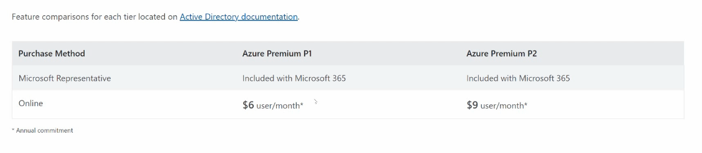
- 
- We can also assign licenses to users
- 
- User must have a usage location when we try to assign a license to the user

## Create Administrative Units
- In on-prem AD, we used to have Organization Units (OUs) and we can assign users to those OUs. Then we could delegate control over the resources in that unit.
- Administrative units are similar in concept. They allow us to categorize our objects together and then we can delegate control over those objects to certain admins using roles.
- You can think of a company that has offices in different cities.
- 
- For this we need atleast Azure AD Premium 1 License
- 
- 
- We can add users to an Administrator Unit and then we can assign Administrative roles to those users.
- 

## Manage User and Group Properties
- We can directly go to the user and the group and edit its properties accordingly.
- Group writeback state is when we are using Azure AD Connect and syncing our Azure AD with our on-prem Active Directory and once it is synced, it writes back to the on prem AD that the operation is done.
- We cannot change the Group Membership type.

## Manage Device Settings and Device Identity
- We can join devices to our Azure AD environment.
- 
- 
- Once our computer is joined, we go to Azure Portal, we go to Azure AD and if we go to the Devices Blade, we can see our device has already joined.
- 

## Configure Self-Service Password Reset(SSPR)
- 
- 
- 
- 
- We can also configure the Security Questions
- It is a straightforward feature
- SSPR is by default turned OFF. We need to turn it ON
  

## Manage Azure using command line tools
- In Powershell we follow the verb-noun system
- For e.g to GET, SET, Start etc.
- To go forward use the tab key and go backward press the Shift key also
- Powershell supports piping | 
- In piping output of one command is input of another command
- 
```shell
$computername = CLIENT10
Get-EventLog -LogName Security -ComputerName $computername -Newest 10 | Format-List | Out-File C:\Security_Log.txt
```
- We can make use of ISE for debugging and running powershell commands
- To check if we have azure commands installed, we can run this command:
```shell
Get-Command -Noun *az*
```
- Go to website: [powershellgallery.com](https://www.powershellgallery.com/)
- To install Azure Modules use this command
```shell
Install-Module -Name Az -Force -AllowClobber
```
- To connect to Azure use this command:
```shell
Connect-AzAccount

# Get all user commands
Get-Command -Verb get -Noun *user*

# Get all Groups
Get-AzADGroup

# What kind of new commands i can run on the user
Get-Command -Verb new -Noun *user*

# Create a new User
New-AzADUser  
```
- 
- AzureADUser is now deprecated
- However to create a new user using AzureADUser use this command
```shell
# Connect to Azure AD
Connect-AzureAD

# Create a password profile
$passwordProfile = New-Object -TypeName Microsoft.Open.AzureAD.Model.PasswordProfile
$passwordProfile.Password = "P@ssw0rd123!"
$passwordProfile.ForceChangePasswordNextSignIn = $true

# Create the new Azure AD user
New-AzureADUser -DisplayName "John Doe" `
    -UserPrincipalName "john.doe@yourdomain.onmicrosoft.com" `
    -PasswordProfile $passwordProfile `
    -MailNickName "john.doe" `
    -AccountEnabled $true `
    -GivenName "John" `
    -Surname "Doe" `
    -UsageLocation "US"

```
- We can also use Cloudshell on Azure Portal
- We can also use Azure CLI which is the bash way of doing things
- In the Cloudshell we will use the Azure CLI
- To create a new Azure AD user using Azure CLI use this command:
```shell
# Login
az login

# Create User
az ad user create \
  --display-name "John Doe" \
  --user-principal-name "john.doe@yourdomain.onmicrosoft.com" \
  --password "P@ssw0rd123!" \
  --force-change-password-next-login \
  --mail-nickname "john.doe" \
  --given-name "John" \
  --surname "Doe" \
  --usage-location "US"

```

## Manage Access to Azure Resources
- Roles provide a way to see exactly what rights are being assigned to a user or group.
- We have RBAC: Role Based Access Control
- Privileges are given based on the role in the organization
- RBAC allows us to give privileges or control over our environment.
- We can achieve RBAC with Groups but it is a management nightmare as the system scales up
- In RBAC, rights are given to the role. 
- We can then assign users/identities to the role.
- Identities can have access to more than one role.
- Microsoft encourages principle of Least Privilege.
- Global Administrator Role is the most powerful role in Azure/Microsoft 365
- Microsoft has implemented PIM(Privileged Identity Management) and using this we can create JIT Administration using roles i.e we can create roles that exist for a specific duration(remember SAS tokens)

### Implementing RBAC in Azure
- 
- 
- 
- 
- 
- 
- 

### Creating Custom Role in Entra ID
- 
- 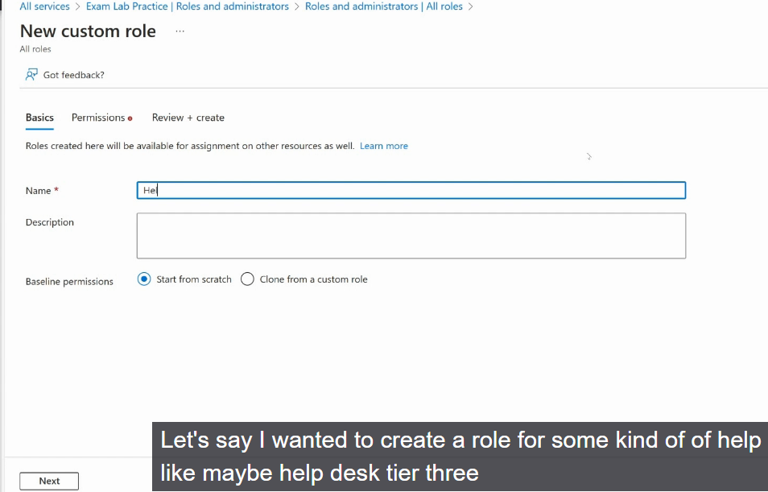
- 
- 

### Providing access to Azure Resources by assigning roles at different scopes
- 
- Management group is a root hierarchial system which helps us to separate our subscriptions
- Subscriptions allow us to purchase Azure Resources
- Goal of a management group is to break subscription up into groups
- Management groups are not critical for all companies
- 
- 
- We cannot nest resource groups i.e cannot have resource group under a resource group
- Resource Groups are for grouping resources under a container.

### Interpret Access Assignments
- 
- 
- 
- 
- Every resource has an IAM

## Manage Azure Subscriptions and governance
### Configure Management Groups
- It is a way to group together our subscriptions and it is a way to make a group of individuals or individual responsible for a subscription
- 
- 
### Manage Subscriptions
- Usually associated with a payment method

### Managing Costs by using alerts, budgets and recommendations
- Azure has a calculator to calculate cost of resources based on usage needs
- 
- We can also see Cost Analysis for each subscription
- 
- We can also set Budgets
- 
- We can also create Action Groups to trigger notifications if budgets exceed a certain threshold.

### Managing Resource Groups
- Resource Groups cannot be nested
- They can contain all kinds of resources
- Resource Groups have to be associated with a subscription
- Resource Groups can include resources from a different region also
- We can also review Cost Analysis and Alerts involving just the resource group also

### Apply and Manage Tags to Resources
- Resource Groups can be Tagged and individual resources can be tagged
- 
- Values are optional
- Names allow us to search by Tags
- 
- Think of it in terms of budgeting, for e.g a billing dept might add billing code tags and have a value associated with it. 
- 

### Configure and Manage Azure Policy
- In On prem AD world, we had GPO(Group Policy Objects)
- In Azure, we have Azure Policies.
- Azure Policies allow us to control certain things, restrict certain things and then we can verify compliance as well.
- Not only is Microsoft creating policies, developers are also creating policies using JSON
- Say we have a Resource Group in East US and storage account in West US
- We want to create a policy on Resoure Group that allows us to add only resources from East US
- 
- 
- We can either assign a policy or a policy initiative.
- Policy is a single thing, initiative is a group of policies.
- Initiative is like GPO.
- 
- We can view the policy definitions as well
- 
- We can build our own policies using JSON
- 
- 
- We can duplicate policy definitions and create our own policy definitions
- We can assign policy directly to resource group
- 
- We need to specify parameters
- 
- 
- Some policies can auto-remediate i.e if a policy violation occurs, the policy can auto-remediate i.e change the text of the location we are trying to assign a resource. However, this current policy doesnot support remediation
- 
- Once we have created a policy, it will take some time for the policy compliance to show up.
- If we try to create a storage account belonging to west-us in east-us Resource Group, it will show us an error message.
- 

### Configure Resource Locks
- 
- Lock Types can be Read-Only or Delete
- 
- 

## Configuring Access to Storage
- 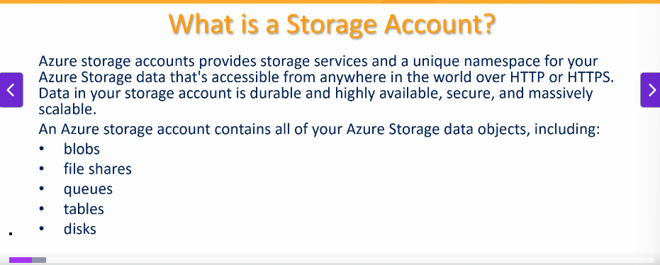
- 
- Storage Accounts use web-based names
- 
- 
- 
- Azure DNS Zone Endpoints use sub-domain names
- Allows Azure to support lot more storage account names
- 

## Create and Configure a Storage Account
- 
- 
- 
- 
- 
- Blobs are a good option to store web-based traffic like audio/video,images,text etc.
- File Shares take the place of a file server
- File Shares support SMB(Server Message Block) and NFS file system.
- 


### Configure Azure Storage Firewalls and Virtual Networks
- We can interact with storage account through an endpoint:
- 
- We can use custom DNS names as well
- 
- 
- 
- In Microsoft Network Routing, data will enter the microsoft azure cloud network and egress from the closest microsoft cloud network to the destination. We can take speed of microsoft high speed fiber networking and they can route the traffic really fast, but it costs money to do so. 
- An alternative to above is to use Internet Routing.
- 

### Configure Azure AD authentication for a Storage Account
- 
- 
- 
- 
- 
- 
- 
- 
- Here Larry will have permissions only if the container has the word backup in it
- So we set access based on conditions

### Manage Access Keys
- We dont have web server put in credentials every time the user accesses the storage account
- So we use access keys
- 

### Using Shared Access Signatures
- For temporary access we use SAS tokens
- These tokens can be generated on the fly.
- 
- 
- 
- 
- 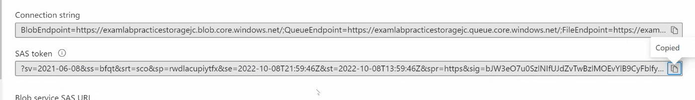
- 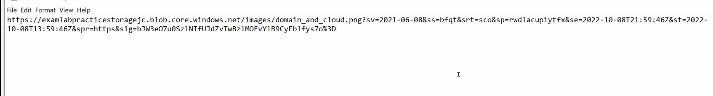
- Notice that we have a signature query string
- If we modify anything in the URL it will not work, because the signature ensures integrity.

### Configure Stored Access Policies
- We want to decide when certain things will expire.
- 
- 
- 
- We can set SAS tokens even at the container level.

## Configure and Manage Storage Accounts
- Lets say we want to upload 500TB data from on-prem to storage account. 
- Simple uploading it may not be feasible.
- Azure allows us to send us hard-drives to their data center.
- If we want to export large amount of data out of Azure, we can also get Azure to send out a hard-drive.
- We can use Azure Data Box
- 
- 
- 
- Select Import/Export Job
- 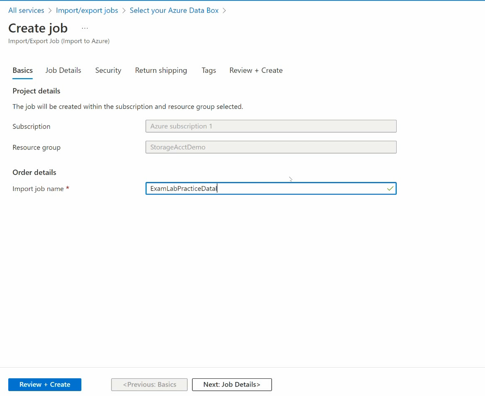
- Microsoft wants to ensure file integrity
- They ensure that using a tool called WAImportExport tool
- It generates a journal file *jrn file
- This file is like a spreadsheet or csv file and has a hash code associated with each file and ensures file integrity.
- Microsoft people can verify the *jrn file and ensure data integrity is maintained.
- 

### Understanding Azure Storage Redundancy
- 
- We have synchronous and asynchronous replication of data
- Are we replicating data to same region or different regions ?
- 
- Data in Azure Storage account is always replicated 3 times in the primary region.
- 
- LRS does however protect us from server rack and drive failures by storing data in different fault domains and update domains.
- 
- 
- 
- 

### Implementing Azure Storage Redundancy
- 
- 
- 

### Configure Object Replication
- We can replicate data from one storage account to another
- 
- 
- 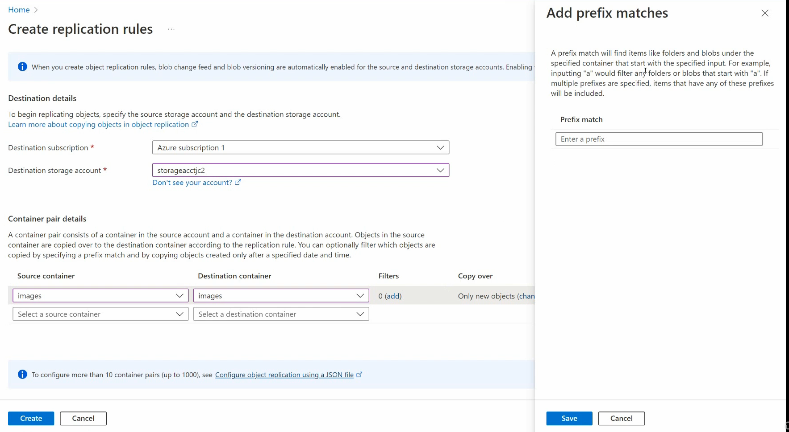
- 

### Configure Storage Account Encryption
- 
- We can have one level of encryption on data and second level of encryption on the infrastructure.
- 
- 
- 
- 
- 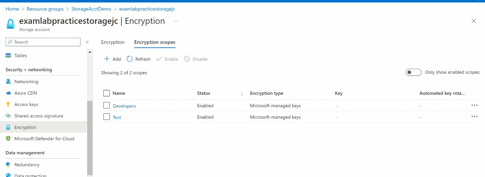
- Encryption scopes in Azure Storage accounts are a feature that allows you to manage encryption at a granular level, specifically for Blob Storage and Azure Files. They enable you to apply different encryption keys to individual blobs, containers, or file shares within the same storage account, creating secure boundaries for data belonging to different customers or applications.
- Encryption scopes provide fine-grained control over encryption, allowing you to isolate data encryption within a single storage account for multi-tenancy scenarios or to meet specific security requirements.
- 

### Manage Data by using Azure Storage Explorer and AzCopy
- Storage Explorer is a downloadable tool
- 
- 
- 
- AzCopy can help us upload large number of files uploaded to Azure Storage Account
- AzCopy needs a SAS token to copy to Azure Storage Account
- 
- 
- AzCopy requires a source file and a destination

## Configure Azure File Share and Configure Storage Tiers
- 
- It is more expensive to use web service based capabilities with FileShares as compared to Blob Containers
- If we need to use SMB protocol which Windows Server use or Windows Client use, then File Shares is a good choice.
- 
- 
- 
- 
- 
- 
- 
- Open Windows Powershell ISE
- We cns run this script on the computers of all the people who need to map this drive.
- Most ISPs block port 445. We need VPN or siteTosite VPN to connect or ExpressRoute to connect to this File Share.
- 

## Configure Blob Storage
- Blob Storage is geared towards web-services and it supports REST, HTTP, HTTPS
- It doesn't support SMB protocol
- We can create a container and create blobs inside of it
- 
- 
- 
- By configuring immutability policies for blob data, we can prevent our data from being overwrites and deletes.
- Once version level immutability support is enabled, it cannot be disabled.
- We can change access level of a particular blob also
- 
- If our access level is private, but there is a SAS token configured, we will still be able to view the blob

### Configure Blob Lifecycle Management
- We have Hot, Cold and Archive Tiers
- 
- 
- 
- 
- 
- 
- Really helps to save some money.

### Configure Blob Versioning
- 
- 
- 
- 
- 
- 
- Sometimes when we open a blob it is in a leased state for a few minutes.
- To force it out of data we can use Break Lease functionality
- 
- We can make any previous version as current version for the blob.
- What is difference between blob version and blob snapshot?
- 
- Snapshot is created by an application but versions are created automatically when the blob is overwritten


## Automate Deployment of Resources using ARM templates or Azure Bicep files
- To implement infrastructure as code for your Azure solutions, use ARM templates.
- ARM templates use declarative syntax.
- 
- ARM templates are expressed in JSON
- 
- 
- 
- ARM templates are shareable

### Azure Bicep
- Bicep is a domain-specific language(DSL) that uses declarative syntax to deploy Azure resources. In a Bicep file, you define the infrastructure you want to deploy to Azure, and then use that file throughout the development lifecycle to repeatedly deploy your infrastructure. 
- It ensures resources are deployed in a consistent manner.
- Bicep and ARM templates serve the same purpose but Bicep has a simpler syntax.
- 
- Bicep has an extension for Visual Studio where intellisense is supported.
- Bicep has its own scripting format.
- Major benefit is its simpler syntax and compact code.

### Modify an ARM template
- Think of an ARM template as a recipe.
- 
- 
- We usually export an ARM template, modify parameters and deploy it

### Deploy an ARM template
- 

### Deploying an Azure Bicep file
- We can create an Azure Bicep file as follows:
```bicep
targetScope = 'subscription'

@description('The Azure region where the resource group will be created.')
param region string = 'eastus'


resource RGDemoBicep 'Microsoft.Resources/resourceGroups@2022-09-01' = {
  name: 'RGDemoBicep'
  location: region
  tags: {
    environment: 'demo'
  }
}


```
- We can deploy it as:
```shell
az deployment sub create --location 'East US' --template-file ./main.bicep --parameters region='East US'
```
- We can create a standard load balancer in Azure using Bicep using this link:
- https://github.com/Azure/azure-quickstart-templates/tree/master/quickstarts/microsoft.network/internal-loadbalancer-create

- 
- Think of VM Extensions as Browser Add-Ons
- They are automatically injected into the VM
- 


### Create and Configure a Virtual Machine
- 
- 
- 
- 
- 
- 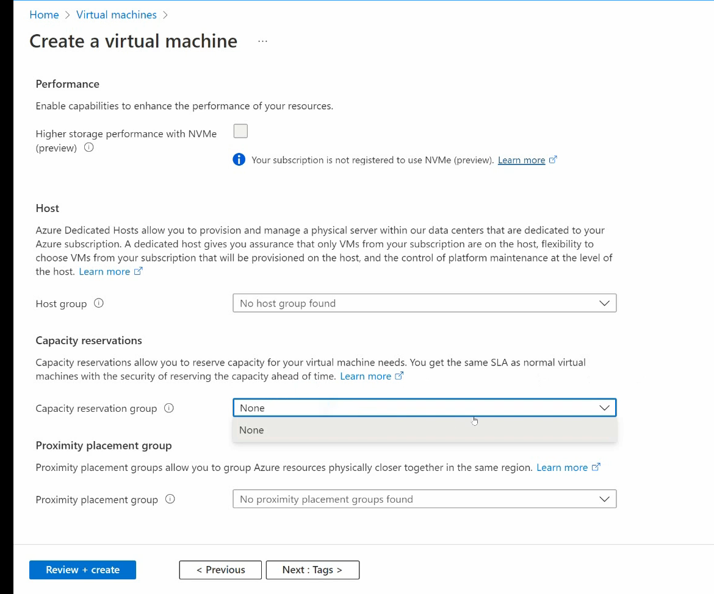

### Create a VM using Powershell
- We can easily write a script to generate a virtual machine
```shell
# Step 1: Connect to Azure
Connect-AzAccount

# Step 2: Define variables
$resourceGroupName = "MyResourceGroup"
$location = "EastUS"
$vmName = "MyAzureVM"
$vmSize = "Standard_D2s_v3"
$adminUsername = "azureadmin"
$adminPassword = ConvertTo-SecureString "P@ssw0rd123!" -AsPlainText -Force
$credential = New-Object System.Management.Automation.PSCredential ($adminUsername, $adminPassword)
$vnetName = "MyVNet"
$subnetName = "MySubnet"
$publicIpName = "MyPublicIP"
$nicName = "MyNIC"

# Step 3: Create a resource group
New-AzResourceGroup -Name $resourceGroupName -Location $location -Force

# Step 4: Create a virtual network and subnet
$subnetConfig = New-AzVirtualNetworkSubnetConfig -Name $subnetName -AddressPrefix "10.0.0.0/24"
$vnet = New-AzVirtualNetwork -ResourceGroupName $resourceGroupName -Location $location -Name $vnetName -AddressPrefix "10.0.0.0/16" -Subnet $subnetConfig


# Step 5: Create a public IP address
$publicIp = New-AzPublicIpAddress -ResourceGroupName $resourceGroupName -Location $location -Name $publicIpName -AllocationMethod Dynamic -Sku Basic

# Step 6: Create a network interface
$nic = New-AzNetworkInterface -ResourceGroupName $resourceGroupName -Location $location -Name $nicName -SubnetId $vnet.Subnets[0].Id -PublicIpAddressId $publicIp.Id


# Step 7: Configure the VM
$vmConfig = New-AzVMConfig -VMName $vmName -VMSize $vmSize
$vmConfig = Set-AzVMOperatingSystem -VM $vmConfig -Windows -ComputerName $vmName -Credential $credential
$vmConfig = Set-AzVMSourceImage -VM $vmConfig -PublisherName "MicrosoftWindowsServer" -Offer "WindowsServer" -Skus "2019-Datacenter" -Version "latest"
$vmConfig = Add-AzVMNetworkInterface -VM $vmConfig -Id $nic.Id
$vmConfig = Set-AzVMBootDiagnostic -VM $vmConfig -Disable


# Step 8: Create the VM
New-AzVM -ResourceGroupName $resourceGroupName -Location $location -VM $vmConfig

# Step 9: Verify the VM
Get-AzVM -ResourceGroupName $resourceGroupName -Name $vmName

```
- The script creates a Windows Server 2019 VM. For a different OS, adjust the -PublisherName, -Offer, and -Skus parameters in Set-AzVMSourceImage.
- The VM size (Standard_D2s_v3) is a general-purpose size; choose a size available in your region (check with Get-AzVMSize -Location $location).
- The public IP is dynamic; change to -AllocationMethod Static for a static IP if needed.
- This script does not configure a network security group (NSG). Add one with New-AzNetworkSecurityGroup to control traffic (e.g., allow RDP on port 3389).

### Using Azure Compute Gallery
- The Azure Compute Gallery is a service in Microsoft Azure that allows you to store, manage, and share custom virtual machine (VM) images, container images, and other compute resources across your organization or with external users. It simplifies the process of creating, versioning, and distributing consistent, reusable images for deploying VMs, Azure Virtual Desktop, and other Azure services.
- 
- 
- 
- 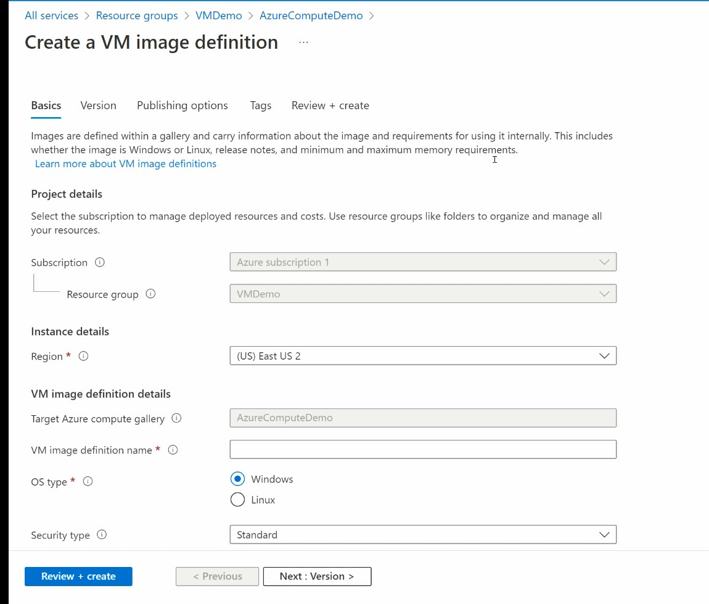
- 
- 
- 
- 

### Configure Azure Disk Encryption
- 
- 
- 

### Move VMs from one Resource Group to Another
- 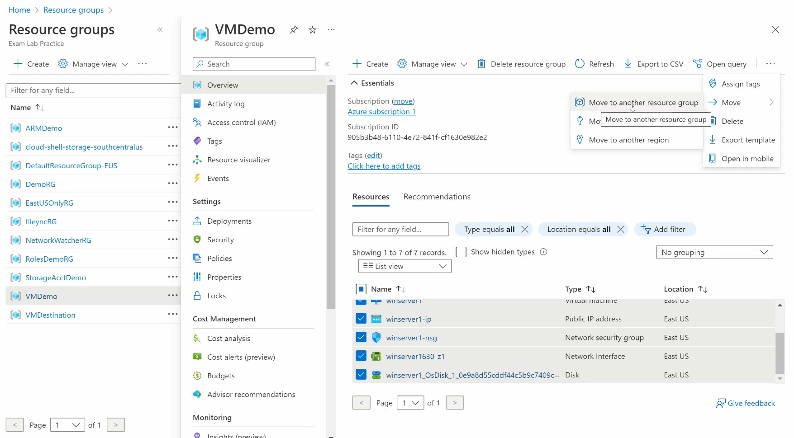
- 
- 


### Manage VM sizes
- 
- 
- 

### Add Data Disks
- 
- 
- 
- 
- 
- 

### Configure VM Network Settings
- 
- 
- 
- 
- 
- 

### Configure VM Availability Options
- 
- 
- 
- 
- Availability Set has a fault domain and update domain
- Update domain is how they update the equipment
- Fault Domain is having the same power supply and being on the same rack
- 
- In availability sets, we setup the VMs ourselves and keep them in different fault and update domains
- Availability Zone allows us to store the VM in different zones.
- 
- 


### Deploy and Configure VM Scale Sets
- VMSS are a great feature that Azure gives us, that allows us to essentially use elasticity with our virtual machines and auto load balancing.
- 
- 
- 
- 
- 
- 
- 
- 
- 
- 
- 
- It shows unhealthy because the webserver is not running and it is running health checks against the specified endpoint in the web-server
- 

## Provision and manage Containers in Azure Portal
- 
- 
- 
- 
- 
- 
- 

### Azure Container Instances
- 

### Understanding Container Groups for ACI
- 
- 
- 
- 
- 
- 

### Create and Configure an App Service
- 
- 
- 
- 
- 
- 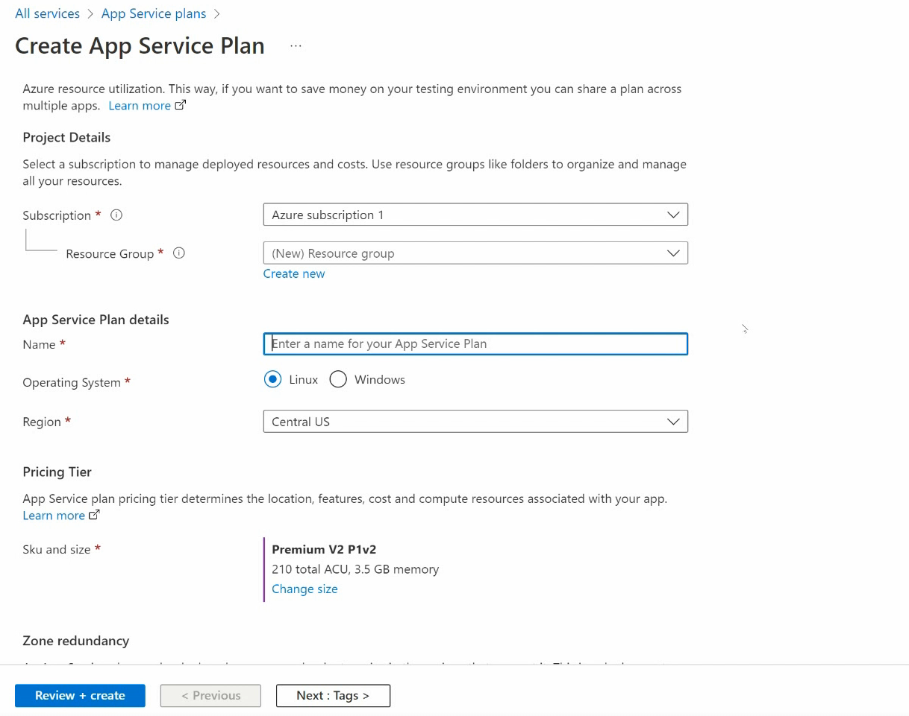
- 
- 
- 
- 
- 
- 
- App Service is the application or workload you deploy (e.g., your web app or API).
- App Service Plan is the infrastructure configuration that powers one or more App Services.
- App Service hosts your code and handles runtime execution.
- App Service Plan defines the capacity, performance, and cost of the resources allocated to those apps.
- App Service: This is the fully managed platform (PaaS) for hosting web applications, APIs, and other services like mobile backends or serverless functions. It provides features like auto-scaling, deployment slots, and built-in CI/CD integration. Essentially, it’s the environment where your application runs, and it supports various runtimes (e.g., .NET, Java, Python, Node.js).
- App Service Plan: This defines the underlying compute resources (e.g., CPU, memory, storage) and pricing tier for one or more App Services. It determines the performance, scalability, and features available to the apps hosted within it. For example, a Free, Shared, Basic, Standard, Premium, or Isolated tier dictates things like the number of instances, custom domains, or SSL support.
- One App Service Plan can support multiple App Services, but each App Service is tied to exactly one App Service Plan.
- For example, you could run multiple web apps under a single App Service Plan to share resources and costs.
- App Service settings focus on app-specific configurations like environment variables, connection strings, or runtime stacks.
- App Service Plan settings focus on resource allocation, such as choosing a tier (e.g., Free, Basic, Premium), scaling options (manual or auto), or region.
- 
- 
- 
- 
- 
- 
- 
- We can buy digital certificates and associate those certificates to the apps
- 
- 

### Configure Custom Domain Names
- 
- 
- 
- 

### Configure Backups
- 
- 
- 
- 

### Configure Networking Settings for App Service
- 
- 
- 
- 
- 
- 
- 
- 

### Configure Deployment Settings
- 
- 
- 
- 
- 

### Configure and manage Virtual Networks in Azure
- Vnet is made up of an address space and it will have a range of IP Address, for e.g from 10.1.0.0/16 which is like 65536 addresses.
- Vnet represents whole network and we have subnets inside that virtual network
- Subnet can be 10.1.1.0/24 which is 256 addresses.
- Subnet addresses are a subset of VNet ip addresses.
- All subnets inside the same Vnet can automatically talk to each other
- NSG has ip filtering capability and have traffic filtering capability. We can place NSG in the subnet or we can put it on the Vnet.
- 
- In our enterprise we may have several Vnets
- Each project may have its own Vnet
- 
- The above is an example of Hub and Spoke Model
- Hub is where all traffic comes in and Spoke Vnets interact with the Hub Vnet
- We may want to connect our on-prem network with Azure
- In that case, we want to ensure our addressing system doesnot interfere with the addressing system used in Azure Subnets
- When we have separate Vnets they don't automatically have routing between them
- So we make use of Vnet peering.
- So all spoke Vnets will talk to the Hub Vnet and Hub Vnet can have Azure Firewall setup to filter incoming traffic
- We can make use of UDRs to direct traffic through something
- We can make use of VPN Gateway to connect an on-premise network to Azure
- To make VPN Gateway work, we need a VPN Concentrator to be installed on the on-premise network
- We can alternatively, use Express Route
- In Express Route, the telecom provider install special hardware inside our on-prem network and then we can use that special hardware to connect directly to the Azure Network using the telecom provider's private network
- It is expensive but it is very fast
- 

### Create and Configure Virtual Networks and Subnets
- 
- Azure Bastion is a secure way to remote into a virtual machine.
- 
- 
- We can add multiple Vnets and various subnets inside it.
- 
- We can then setup a hub and spoke model.
- 

### Creating Vnets with Powershell
- 

### Creating and Configuring Vnet Peering
- Creating Vnets and Subnets costs no money but, Vnet peering costs money
- 
- 
- 
- 
- 

### Configuring private and public IP Addresses
- 
- 
- 
- 

### Configure User defined network routes
- What about a scenario when we want to force traffic through a particular subnet
- What if there is a firewall setup inside a Vnet and we want all traffic to go through that firewall
- For this purpose, we use UDRs(User Defined Routes)
- UDRs force traffic through a particular subnet
- 
- We will now create a Route Table
- 
- 
- 
- Lets we have a firewall defined at 10.1.10.10 inside the AzureFirewallSubnet of Vnet1
- We can setup a user defined route as follows:
- 
- 
- Now we will associate subnets to this
- 
- 

## Configure Secure Access to Virtual Networks
### Create and Configure NSGs and ASGs
- NSG are a set of IP Filter rules
- IP Filtering is where we decide to either allow or block traffic based on a source or a destination
- Do we want to block based on a port or a protocol
- In Azure, the way we control IP Filtering is through a NSG
- NSG can be placed inside a subnet or NIC directly.
- NSGs can be associated with a subnet in a virtual network (VNet). This applies the NSG rules to all resources (e.g., virtual machines, load balancers) within that subnet.
- NSGs can be applied directly to a virtual machine's network interface (NIC). This allows for more granular control over the traffic to and from a specific VM.
- An NSG can be associated with multiple subnets or network interfaces, and a subnet or NIC can have only one NSG associated with it.
- Configuration is done via the Azure Portal, Azure CLI, PowerShell, or ARM templates
- Microsoft recommends us to minimize the number of NSGs
- ASG: Application Security Group. It can be associated to the whole VM. If a VM has lot of NICs, then ASG rules apply to all the NICs
- In Microsoft Azure, an Application Security Group (ASG) is a feature that simplifies network security management by allowing you to group virtual machines (VMs) or network interfaces (NICs) based on their roles, functions, or applications, and then apply network security policies to these groups. ASGs are used in conjunction with Network Security Groups (NSGs) to define fine-grained network security rules without relying on explicit IP addresses.
- 
- 
- NSG rules are applied in order of priority. Lowest Number has highest priority.
- We can do explicit Deny vs Implicit Deny
- 
- 
- 
- 
- We can apply NSG to multiple Subnets or NICs
- 
- 
- 
- 
- 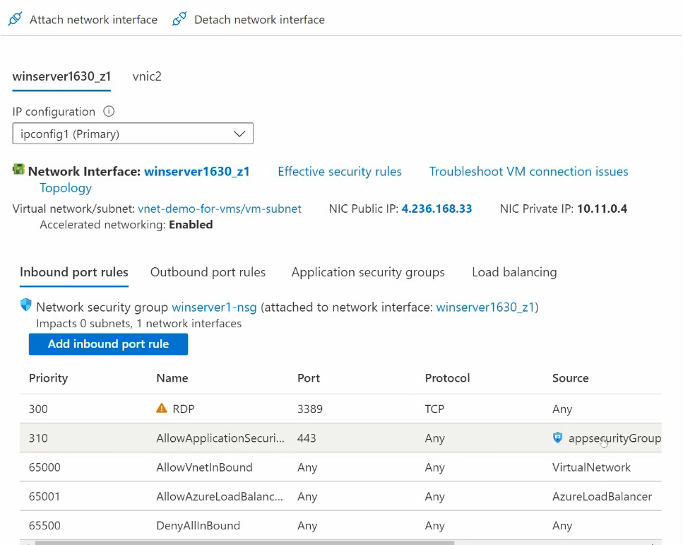
- ASGs can be associated with all vNICs on the VM Device

### Evaluate Effective Security Rules
- 

### Implement Azure Bastion
- Microsoft recommends not exposing port 3389 either through RDP or SSH directly to the internet to access a virtual machine.
- As opposed to VPN Gateway or Express Route or RDP or SSH, we can use Azure Bastion
- 
- 
- Think of Bastion like a DMZ or perimeter network
- Establishes a secure connection to the VM
- Bastion instead of using port 3389 uses port 443 which is meant for HTTPS traffic and hence is more secure.
- 
- Bastion allows connection using a web browser.
- Bastion, however does involve a cost aspect.
- 
- 
- Now we are connected to the VM using a web browser using HTTPS and a very secure connection.
- Bastion connects directly to the VM using the Azure Network and it bypasses the NSGs altogether.
- Hence, no need to expose port 3389.


### Service Endpoint vs Private Endpoint
- A service endpoint allows virtual machines to be able to communicate directly with, storage accounts on the Azure environment without having to go out to the internet and then back in.
- This is what a private endpoint also does :)
- If we have multiple storage accounts and if we enable a service endpoint all of those storage account can interact with the VM directly
- Private endpoint is a 1-1 connection. If we have a private endpoint then only 1 storage account will talk to the VM
- In a private endpoint our subnet will get a vNIC and storage account is linked to the vNIC and it will have a private IP Address.
- 
- 
- 
- 

## Configure Name Resolution and Load Balancing
- We can associate a custom domain name with Azure AD
- 
- 
- 
- We can also have DNS names associated with various resources inside our VNETs and Subnets.
- We have a private DNS Zone and public DNS Zone.
- 
- 
- In Private DNS Zones, we can have domain names registered with various internal Azure resources and these custom domain names work inside Azure only, they dont work in the public internet.
- 
- We also have public DNS Zones.
- 
- 
- 
- 
- 
- 
- On-premise network can also connect to the Private DNS Zone
- 
- We should already own the DNS Name(purchased through GoDaddy) for the DNS Zones to work. 
- 
- If we purchased our DNS Name through GoDaddy.com we need to go to GoDaddy and specify the Name Servers above for our custom domain to work.
- 

### Visualizing Azure Load Balancing
- 
- Load balancer has health probes that monitor the VMs
- In Layer 7 App GW, we can do URL based load balancing.

### Configuring an internal or public Load Balancer
- 
- 
- 
- 
- 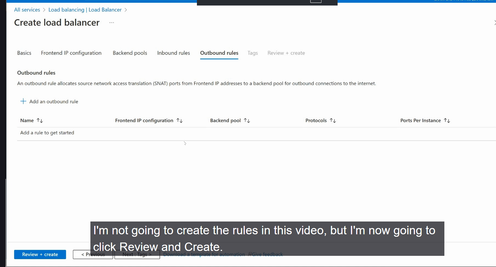
- 
- 
- 
- 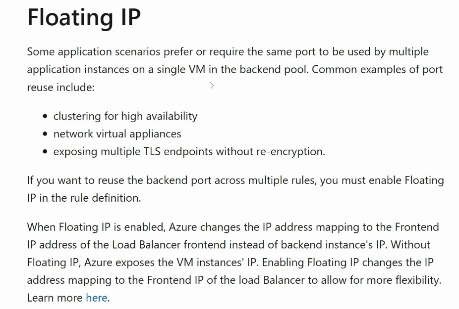
- 
- 
- 
- 
- 
- 
- 
- Using the inbound NAT rule, we can connect to the load balancer public IP and a specific port(say 3389) and then we can connect to VM1 through RDP. It basically looks at the IP-Port combination
- 
- 

## Creating Azure Application Gateway
- 
- 
- 
- 
- Azure App GW will be placed inside its own subnet
- 
- 
- 
- 
- 
- 
- 

## Monitor Issues in Azure
- We have Azure Monitor
- 
- 
- 
- Log Analytics Workspace costs money especially when we use it to store metrics from various applications
- 
- 
- 
- 
- 
- 
- 
- 
- 
- 
- 
- 


### Query and Analyze Logs
- We make use of KQL
- 

### Setup Alerts and Actions
- 
- 
- 
- 
- 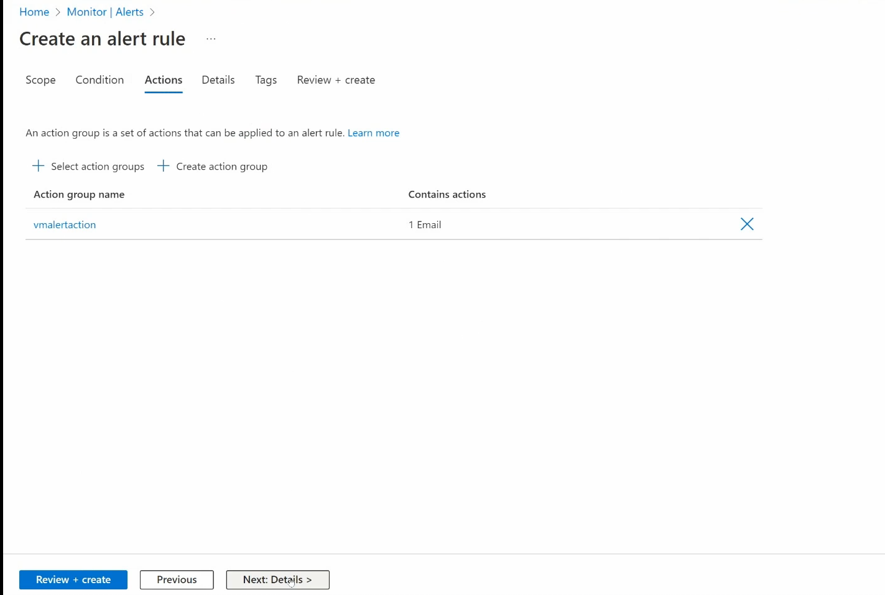
- 

### VMInsights
- Gives quick glimpse of all of our resources
- 
- 

### Configure and use Azure Monitor for networks and on-prem connectivity
- 
- 
- 
- 

### Azure Network Watcher
- 
- It is automatically turned on where we have a virtual network in a region
- 
- Azure Network Watcher is a service provided by Microsoft Azure that enables monitoring, diagnostics, and analytics for Azure virtual networks. It helps users gain insights into network performance and health, troubleshoot issues, and ensure secure and efficient network operations.
- Network Monitoring:
- Topology Visualization: Provides a visual representation of your network resources and their relationships within a virtual network.
- 
- 
- Connection Monitor: Tracks network connectivity and performance between Azure resources, on-premises systems, or hybrid environments over time. It measures latency, packet loss, and network changes.
- Traffic Analytics: Analyzes network traffic patterns to identify trends, detect anomalies, and optimize network performance using flow logs from Network Security Groups (NSGs).
Diagnostics Tools:
- IP Flow Verify: Checks if a specific traffic flow is allowed or denied based on NSG rules, helping troubleshoot connectivity issues.
- 
- Next Hop: Determines the next hop for traffic from a virtual machine (VM) to a destination, aiding in routing issue diagnosis.
- 
- Effective Security Rules: Displays the effective NSG rules applied to a VM, simplifying security configuration analysis.
- Packet Capture: Captures network packets to and from VMs for detailed inspection, useful for diagnosing application or security issues.
- VPN Diagnostics: Troubleshoots connectivity issues with Azure VPN Gateway or ExpressRoute by analyzing logs and configurations.
- Performance and Health Insights:
- NSG Flow Logs: Logs information about ingress and egress IP traffic through NSGs, enabling detailed traffic analysis.
- 
- Network Performance Monitor: Provides insights into network performance, including latency and packet loss, across Azure and hybrid environments.
- Connection Troubleshooting: Offers automated diagnostics for connectivity issues between Azure resources or external endpoints.
- 

### Troubleshooting external networking
- We will use Azure network watcher to troubleshoot external connectivity
- 
- 
- 
- 
- 

### Troubleshoot Virtual Network Connectivity
- To troubleshoot virtual network connectivity in Azure using Network Watcher, you can leverage its diagnostic tools to identify and resolve issues like blocked traffic, routing problems, or performance bottlenecks.
- Purpose: Captures network packets to analyze traffic for deeper troubleshooting.
Steps:
- Navigate to Network Watcher > Packet Capture.
- Create a new capture by selecting the VM and storage account for saving the capture file.
- Set filters (e.g., protocol, IP, port) to focus on specific traffic.
- Start the capture, reproduce the issue, then download the .pcap file.
- Analyze the file using tools like Wireshark to inspect packet-level details.
- Use Case: Debug application-layer issues or confirm if packets are reaching the destination.
- 
- 

## Implement Backup and Recovery
### Create an Azure Recovery Services Vault
- 
- 
- 
- 
- 
- 

### Create and configure a backup policy
- 
- 
- 
- 

### Doing backup and Restore operations
- 
- 
- 
- We can restore from a snapshot if the file is overridden or lost
- 
- 
- 
- 
- 
- 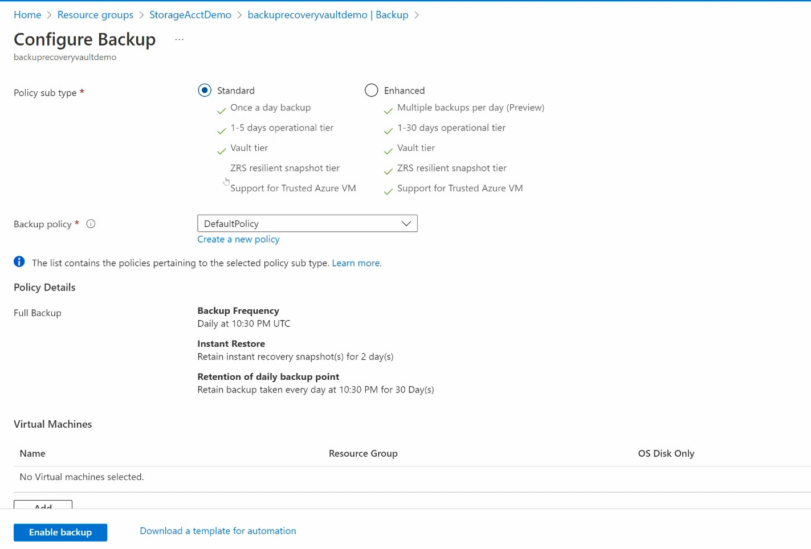

### Configuring Azure Site Recovery
- 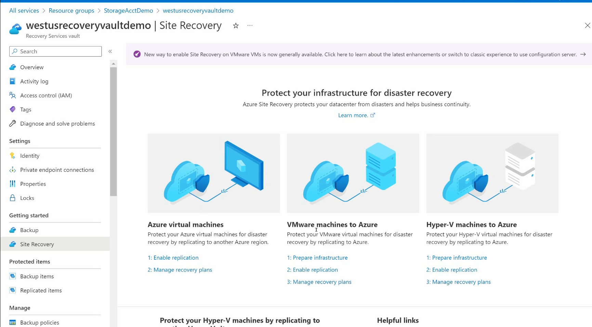
- 
- 
- 
- 
- 
- 

### Configure and review backup reports
- 
- 
- 
- 
- 
- 
